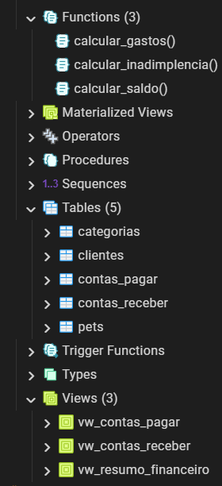
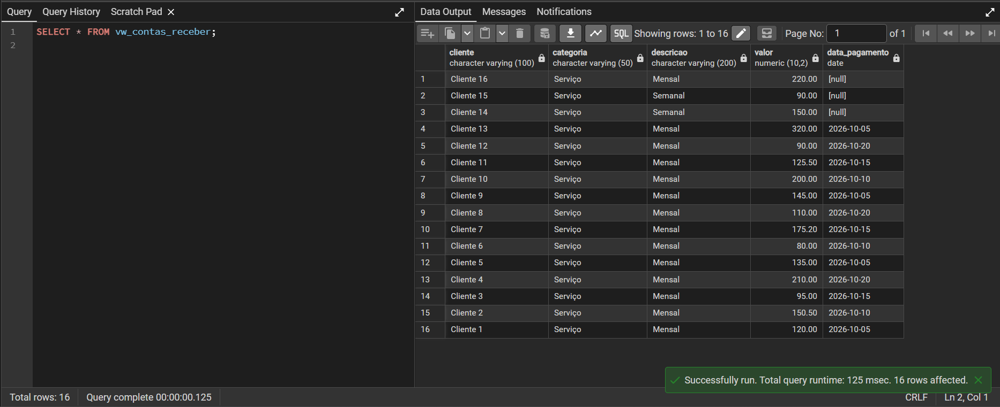
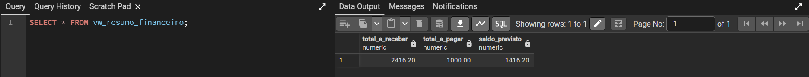
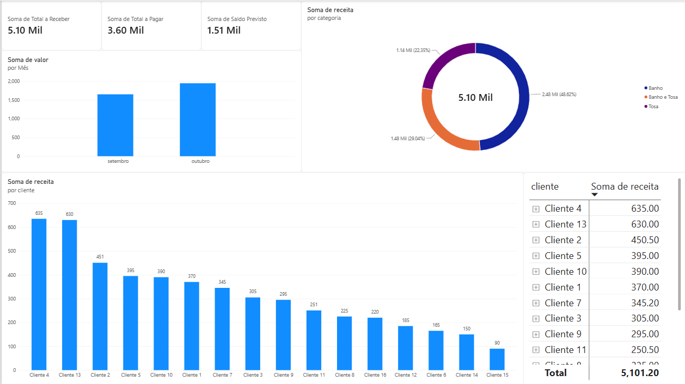

# Sistema de Banco de Dados Relacional para Gestão Financeira de Pet Shop

Este repositório contém a modelagem conceitual, implementação física e tunagem de performance de um banco de dados relacional de alta integridade, desenvolvido em **PostgreSQL** e integrado ao **Power BI**. O projeto é focado no controle operacional robusto, faturamento recorrente e gerenciamento analítico de fluxo de caixa para empresas do segmento de pet shop.

## Estrutura do Projeto

O projeto foi estruturado seguindo as melhores práticas de versionamento de banco de dados e migrações (*migrations*), sendo segregado em módulos sequenciais para garantir a modularidade e a manutenibilidade do código:

* **`sql/01_schema.sql`**: Definição da estrutura das tabelas, chaves primárias, chaves estrangeiras, constraints e restrições de integridade.
* **`sql/02_seed.sql`**: Carga de dados fictícios estruturada para testes de volume, validação de integridade e simulações contábeis de fidelidade e recorrência.
* **`sql/03_queries.sql`**: Consultas analíticas aplicadas a Business Intelligence (BI) através de junções avançadas (`INNER JOIN`) e agregações.
* **`sql/04_views.sql`**: Camadas de abstração criadas para simplificar o acesso da aplicação e de ferramentas de BI a relatórios complexos.
* **`sql/05_functions.sql`**: Inteligência interna do banco através de funções matemáticas financeiras e **Triggers de Auditoria** desenvolvidas em **PL/pgSQL**.
* **`sql/06_indexes.sql`**: Configurações de planos de execução e otimização de performance através de índices focados em alto volume de consultas.
* **`bi/dashboard_financeiro.pbix`**: Arquivo de Business Intelligence do Power BI integrado nativamente ao motor relacional do PostgreSQL.

## Funcionalidades e Regras de Negócio Implementadas

* **Arquitetura Relacional Normalizada**: Modelagem baseada nas Formas Normais com relacionamento **1:N entre Clientes e Pets**, mapeando com precisão o histórico e a recorrência de atendimento de múltiplos animais por tutor.
* **Integridade Referencial e Cascade**: Uso de constraints de chaves estrangeiras com cláusula `ON DELETE CASCADE` para garantir a consistência das tabelas e impedir a existência de registros órfãos.
* **Validação de Entrada de Dados (Data Constraining)**: Cláusulas `CHECK` estritas que asseguram que valores monetários sejam estritamente positivos e que classificações contábeis aceitem apenas os domínios `'RECEITA'` ou `'DESPESA'`.

## Diferenciais Técnicos e Otimização de Performance

* **Estratégia de Indexação B-Tree**: Criação de índices manuais nas chaves estrangeiras e no relacionamento `pets.id_cliente`, eliminando operações de *Sequential Scan* e otimizando os múltiplos `JOINs` para consultas instantâneas.
* **Abstração Contábil Nativa**: Desenvolvimento das funções `calcular_saldo()`, `calcular_gastos()` e `calcular_inadimplencia()`, movendo o processamento matemático complexo para o servidor PostgreSQL, minimizando a latência e o consumo de banda de rede.
* **Tipagem Temporal Estrita**: Uso exclusivo do tipo de dado nativo `DATE` para controle cronológico real, permitindo a utilização semântica do estado `NULL` para identificar contas inadimplentes e habilitar filtros avançados por períodos.

## Camada de Visualização & Business Intelligence (BI)

O projeto conta com uma integração analítica completa dividida em duas camadas de validação demonstradas na pasta `screenshots/`:

1. **Camada Técnica (pgAdmin 4):** Validação da saúde da estrutura de dados via scripts SQL, checagem da árvore de objetos gerada e testes de integridade relacional.
2. **Dashboard Gerencial (Power BI):** Dashboard executivo desenhado com foco em UX/UI, consumindo as views do banco de dados para apresentar cartões de controle financeiro, faturamento por categoria, fluxo de caixa mensal e uma matriz detalhada de fechamento operacional.

### Demonstração Visual do Projeto

#### Estrutura e Validação no pgAdmin 4
* **Árvore de Objetos Criados (Tabelas, Views e Funções):**

* **Confirmação de Execução e Status de Operação do Banco:**

* **Resultado Prático do Retorno da Camada de Abstração Contábil (Views):**

#### Análise de Dados no Power BI
* **Dashboard Financeiro de Controle Operacional:**

## Instruções de Implantação

1. Instancie um servidor PostgreSQL e crie um banco de dados vazio (ex: `petshop_db`).
2. Execute os scripts localizados no diretório `sql/` respeitando estritamente a ordem de numeração dos arquivos (`01_schema.sql` ao `06_indexes.sql`).
3. Para abrir o relatório de BI, baixe o arquivo localizado em `bi/dashboard_financeiro.pbix` e abra no Power BI Desktop. Os dados salvos em cache carregarão automaticamente na tela.
